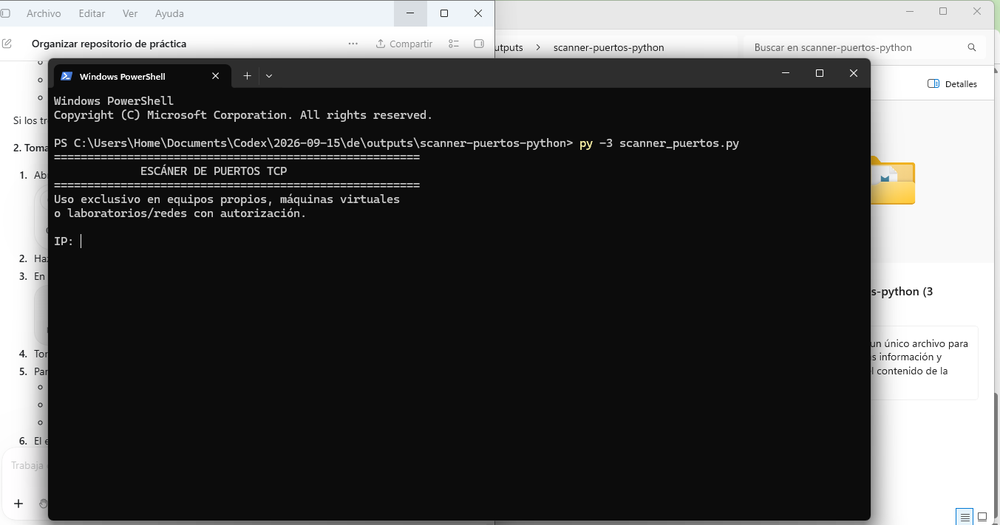
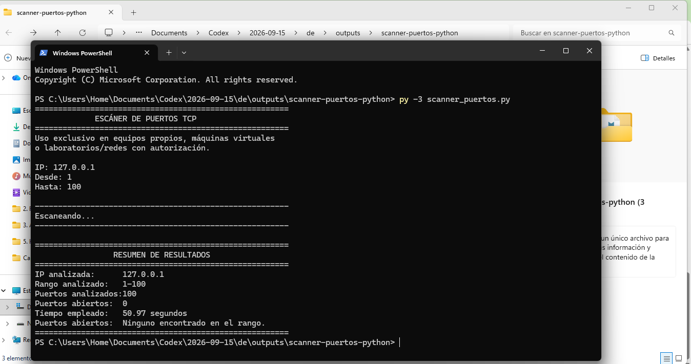

# Manual de uso del escáner de puertos TCP

Práctica N.º 2 de Seguridad Informática — Universidad Estatal de Milagro (UNEMI).

Documento adaptado a partir del manual entregado por Pamela del Rocío Merizalde Ortiz, con autorización de Anderson Jose Vega Guillin, para corresponder a `scanner_puertos.py`. El programa recibido del responsable técnico se conserva sin modificaciones.

## 1. Requisitos

- Python 3.6 o posterior, compatible con las cadenas de texto con formato del programa.
- Una terminal, como PowerShell o la terminal integrada de Visual Studio Code.
- El archivo `scanner_puertos.py`.
- Un equipo propio o un destino expresamente autorizado.

El código utiliza `socket` y `datetime`, incluidas en Python. No necesita paquetes externos. Visual Studio Code es opcional para ejecutarlo.

## 2. Instalación y preparación

Si no se dispone de Python, instalar Python 3 desde su distribuidor oficial. Verificar la instalación con `python --version`, `python3 --version` o `py --version`, según el sistema.

Guardar los archivos en una misma carpeta y abrir una terminal en ella. En Visual Studio Code se puede abrir la carpeta del proyecto y seleccionar **Terminal > Nueva terminal**.

## 3. Iniciar la aplicación

Ejecutar el comando correspondiente a la instalación:

```bash
python scanner_puertos.py
```

O bien:

```bash
python3 scanner_puertos.py
```

En Windows, si está disponible el lanzador, también puede utilizarse:

```powershell
py -3 scanner_puertos.py
```

Aparecen el título `ESCÁNER DE PUERTOS TCP`, una indicación de uso autorizado y la solicitud `IP:`. Esta versión no se inicia con `escaneo.py`.

## 4. Ingresar la dirección IP

En `IP:`, escribir la dirección IPv4 del equipo autorizado y pulsar Enter. Para una prueba sobre el mismo equipo se puede utilizar `127.0.0.1`, dirección de bucle local. Es un ejemplo de entrada, no un resultado experimental del grupo.

Utilizar el formato convencional de cuatro números separados por puntos. Si el programa rechaza la dirección, solicita ingresarla nuevamente. No ingresar una URL.

## 5. Seleccionar el rango de puertos

En `Desde:`, ingresar un número entero entre 1 y 65535. En `Hasta:`, ingresar otro número del mismo intervalo, mayor o igual al inicial. El programa incluye ambos extremos.

Si se ingresa texto, un número fuera del intervalo o un final menor que el inicio, se muestra un mensaje y se solicita corregir el dato.

Por ejemplo, sobre el propio equipo se puede seleccionar de `1` a `100`. No se garantiza que ese rango contenga puertos abiertos.

## 6. Ejecutar el escaneo

Después de aceptar el puerto final, el escaneo comienza automáticamente y aparece `Escaneando...`. **Esta versión no solicita confirmación «S/N».**

El programa comprueba los puertos secuencialmente, con un tiempo de espera de 0,5 segundos por intento. Un rango amplio puede tardar. Para interrumpirlo, pulsar Ctrl+C; puede aparecer un mensaje de interrupción y no se genera el resumen final.

## 7. Interpretar los resultados

Cada conexión TCP exitosa se muestra mediante el número del puerto seguido de `ABIERTO`.

Al finalizar, `RESUMEN DE RESULTADOS` muestra:

- IP analizada.
- Rango analizado.
- Número de puertos analizados.
- Cantidad de puertos abiertos.
- Tiempo empleado en segundos.
- Lista de puertos abiertos, o indicación de que no se encontró ninguno en el rango.

Un puerto abierto indica que se pudo establecer una conexión TCP durante la prueba. Un intento fallido puede deberse a un puerto cerrado, filtrado, un tiempo de espera agotado u otro error de red. **El programa no distingue esas causas ni muestra una cantidad de puertos cerrados.** Tampoco identifica servicios o vulnerabilidades.

## 8. Problemas frecuentes

| Situación | Acción |
| --- | --- |
| No se reconoce `python` | Comprobar la instalación y probar `python3` o `py -3`, según corresponda. |
| No se encuentra el archivo | Abrir la terminal en la carpeta correcta y comprobar el nombre `scanner_puertos.py`. |
| Se solicita repetir una entrada | Leer el mensaje y corregir la dirección o el rango. |
| No se encuentran puertos abiertos | Revisar el destino autorizado y el rango. El resultado no demuestra que todos estén cerrados. |

## 9. Capturas de funcionamiento

Las siguientes capturas reales fueron proporcionadas por Anderson durante la ejecución de `scanner_puertos.py` en su propio equipo. Se conservan sin alteraciones.

### Inicio de la aplicación



Figura 1. Ejecución del programa y solicitud de la dirección IP.

### Entradas y resumen de resultados



Figura 2. Escaneo sobre el propio equipo y resumen final.

La captura muestra la dirección `127.0.0.1`, el rango del 1 al 100, 100 puertos analizados, 0 puertos abiertos y un tiempo de 50,97 segundos. El programa indica que no encontró puertos abiertos en ese rango. Esto no permite afirmar que todos estén cerrados ni que no existan puertos abiertos fuera del rango analizado.

Estas imágenes documentan el uso del programa; no sustituyen la prueba experimental que corresponde a la integrante responsable. La evidencia del repositorio GitHub se entrega por separado.

## 10. Uso responsable

Utilizar la herramienta exclusivamente con fines académicos y educativos sobre equipos propios, máquinas virtuales, laboratorios autorizados o redes expresamente autorizadas. Confirmar el destino y la autorización antes de ingresar el puerto final, porque el escaneo comienza automáticamente.
